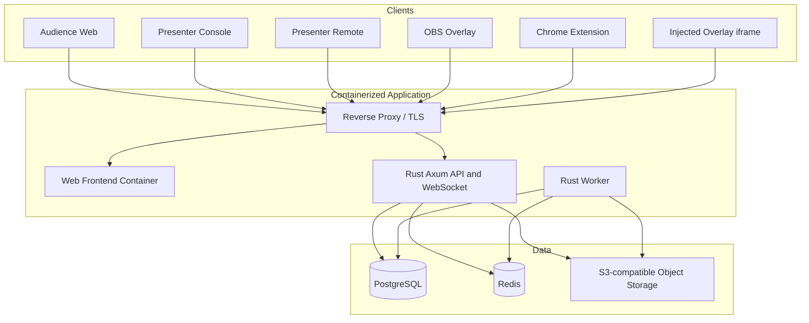

# Slide Helper 完整開發計畫

- 文件狀態：Draft v2（Rust／Container／OAuth／i18n 架構版）
- 建立日期：2026-08-13
- 產品階段：Greenfield / Pre-MVP
- 主要語言：繁體中文（`zh-TW`）與英文（`en`）同時列為 P0

## 1. 執行摘要

Slide Helper 是一個跨簡報軟體的「即時觀眾互動層」。它不取代 Google Slides、PowerPoint 或 Keynote，而是讓講者把理解度、投票、文字雲與 Q&A 等互動掛在既有簡報流程上。

產品同時支援兩種播放方式：

1. **自動跟隨**：Chrome Extension 偵測 Google Slides 實際顯示的投影片，依穩定的 `slideId` 自動切換對應互動。
2. **手動 Cue**：講者用手機遙控器、講者控制台或 OBS Dock 切換互動，支援 Keynote、PDF、Canva、PowerPoint 與其他無法自動偵測的軟體。

兩種方式必須共用同一個即時狀態核心。切換模式時不能清空回答、關閉題目或要求觀眾重新加入。

MVP 的產品承諾是：

> 講者沿用原本的簡報；觀眾掃一次 QR Code；Google Slides 可以自動跟隨，其他軟體可以手動控制；互動結果可只給講者看，也可顯示在簡報或 OBS Overlay 上。

## 2. 開發假設

時程估算以以下團隊為基準：

- 2 位全端／前端工程師
- 0.5 位產品設計師
- 0.25 位 QA 或由工程師共同負責
- 每個 Sprint 兩週

在此配置下，封閉測試版預估 10～12 週。若由一位工程師獨立開發，較合理的估算是 16～20 週。

初始容量與效能目標採務實、可觀測但不過度最佳化的標準：

- 每場 100 位同時在線觀眾；封閉測試期間可視壓測結果調整
- 每位觀眾同一題最多一個有效回答；是否能修改由題目設定決定
- 回答送出到講者看到統計的 p95 延遲小於 2 秒
- Google Slides 實際換頁到系統更新的 p95 延遲小於 1 秒
- 即時連線中斷後，正常網路恢復時 10 秒內完成重新同步

以上是觀測目標，不是公開 SLA；短暫超標不單獨阻擋封閉 Beta，但資料遺失、狀態錯亂或無法恢復仍屬阻擋問題。正式擴大容量前必須重新壓測。

## 3. 產品原則

### 3.1 不重做簡報

Slides／PowerPoint 管理內容與視覺；Slide Helper 管理互動 Cue、觸發方式、結果顯示與講者決策。

### 3.2 觀眾零安裝、低摩擦

- 觀眾整場只掃一次 QR Code。
- 觀眾不需要註冊。
- 一般行動網路下在數秒內可以開始回答。
- 手機為主要觀眾裝置，但桌面瀏覽器也要可用。

### 3.3 講者結果與公開結果分離

每個互動都必須能設定：

- 僅講者可見
- 關題公開、結果隱藏
- 關題與結果即時公開
- 關閉回答後才公開結果

### 3.4 自動不是唯一控制來源

Extension 是自動 Adapter，不是產品核心。手動模式是第一級功能，且必須能隨時接手。

### 3.5 實際投影片 ID 優先於按鍵次數

自動跟隨以 Google Slides 實際 `slideId` 為準，不以右箭頭、空白鍵或簡報筆按壓次數計頁，避免動畫造成漂移。

### 3.6 接受回答後不可默默遺失

即時廣播用於低延遲畫面更新；回答與正式狀態仍需持久化。重新連線時以伺服器快照為準。

### 3.7 中英文是同一個產品能力

- MVP 同時支援 `zh-TW` 與 `en`，不是完成中文版後才翻譯。
- 所有系統文案使用 key-based i18n，不在元件、API 或 Extension 中寫死顯示字串。
- 使用者建立的題目與回答保持原文，不自動翻譯。
- 前端依瀏覽器語言選擇預設語系，並允許使用者手動切換。
- 後端回傳穩定的錯誤碼與結構化參數，由 Client 負責本地化顯示。

## 4. 使用者與操作介面

### 4.1 角色

| 角色 | 說明 | 權限 |
|---|---|---|
| Owner | 建立互動專案的講者 | 編輯、播放、看完整結果、匯出 |
| Presenter | 被授權共同簡報的人 | 播放、控制 Cue、看完整結果 |
| Controller | 手機遙控器或 Extension | 依授權切換 Cue 與控制題目 |
| Audience | 觀眾 | 加入、回答、看允許公開的結果 |
| Overlay | 唯讀顯示端 | 只讀取經過裁切的公開畫面狀態 |

### 4.2 五個主要介面

1. **互動編輯器**：建立專案、Cue 與題目。
2. **講者控制台**：播放時顯示目前 Cue、統計、警告與下一步。
3. **講者手機遙控器**：手動切換、開關回答、公開結果。
4. **觀眾頁面**：加入與回答。
5. **Overlay Renderer**：同一個渲染器供 OBS Browser Source 與 Extension 注入 iframe 使用。

## 5. MVP 範圍

### 5.1 P0：封閉測試版必須有

- Google OAuth / OpenID Connect 講者登入
- 建立、複製、封存互動專案
- 建立 Live Session 與六位數加入碼
- QR Code 加入
- 三欄式互動編輯器
- 手動 Cue 排序與手機遙控器
- Google Slides Chrome Extension 自動跟隨
- 自動、暫停、手動、斷線、待重新同步狀態
- Extension 斷線後無損切換手動模式
- 四種互動：
  - 三段式理解度
  - 單選題（支援四選一，但資料模型不限制四個選項）
  - 文字雲
  - Q&A 與按讚
- 回答人數與回覆率
- 題目開啟、關閉、重新開啟
- 結果即時公開或關閉後揭曉
- 理解度門檻提示，例如紅燈超過 25%
- 透明 OBS Overlay
- Google Slides 頁面內注入 Overlay
- 教學、Lightning Talk、產品 Demo 三組模板
- Session 結束後基本結果頁與 CSV 匯出
- 繁體中文與英文介面，涵蓋 Web、Extension、Audience、Remote 與 Overlay
- 基本垃圾訊息、洗票與頻率限制

### 5.2 P1：公開 Beta 前加入

- 投影片縮圖匯入與較完整的 Deck Mapper
- 互動延遲啟動
- 選項排序、1～5 分量表、節奏回饋
- Q&A 審核佇列與置頂
- 文字雲同義詞合併與停用詞管理
- 參與者分組
- 專案共同編輯權限
- 品牌色與 Overlay 佈景主題
- PDF 報表
- 前測／後測比較
- Session 複製與結果保留策略

### 5.3 暫不納入 MVP

- PowerPoint 原生 Content Add-in
- Google Workspace Marketplace Add-on
- Keynote 自動偵測
- Windows/macOS 原生透明懸浮程式
- AI 自動生成完整簡報
- 正式考試與成績簿
- 金流與訂閱方案
- 大型企業 SSO、SCIM、稽核紀錄
- 超過 500 人的單場保證容量

## 6. 核心使用流程

### 6.1 建立互動專案

1. 講者建立專案。
2. 選擇空白專案或教學／Lightning Talk／產品 Demo 模板。
3. 選擇同步方式：Google Slides 自動跟隨、手動 Cue、稍後設定。
4. 若選 Google Slides，透過 Extension 將瀏覽器中的 Deck 與專案配對。
5. 在左側投影片／Cue 流程選擇位置。
6. 選擇互動目的，例如「確認是否理解」。
7. 系統推薦題型並帶入預設文案。
8. 設定觸發、結果可見性、回答限制與講者門檻。
9. 切換投影、手機、講者三種預覽。
10. 儲存並進入彩排。

### 6.2 Google Slides 自動跟隨

1. 講者啟動 Live Session。
2. Extension 用一次性配對碼取得該場次的 Controller 權限。
3. Extension 確認目前 Deck ID 與專案綁定資料相符。
4. 講者照平常方式播放 Google Slides。
5. Content Script 偵測實際 `slideId` 改變。
6. Extension 送出帶有冪等鍵與狀態版本的 `slide.changed` Command。
7. 伺服器把該 slide 映射到 Cue，更新唯一權威狀態。
8. 若 Cue 設為 `presenter_confirm`，控制台只顯示「已準備」；講者再按開始。
9. Audience、Presenter、Overlay 收到各自權限範圍內的 State Event。

### 6.3 手動 Cue

1. 講者在手機開啟 Presenter Remote。
2. 畫面只顯示目前互動、下一個互動與大按鈕。
3. 講者選擇上一個／下一個 Cue，或直接從清單跳轉。
4. 中間沒有互動的投影片不需要逐頁操作。
5. OBS Overlay、觀眾頁與講者控制台使用相同即時狀態。

### 6.4 Extension 斷線接手

1. Extension 心跳超時，伺服器把同步狀態改為 `DISCONNECTED`。
2. 目前 Cue、回答與 Overlay 保持不變。
3. 講者看到「重新連線」與「改用手動控制」。
4. 選手動後，控制游標停在最接近的 Cue。
5. Extension 恢復時進入 `RESYNC_REQUIRED`，不得自行搶回控制權。
6. 講者選擇恢復自動或繼續手動。

## 7. 互動編輯器設計

### 7.1 三欄配置

| 區域 | 內容 |
|---|---|
| 左側 | 投影片縮圖或手動 Cue 時間軸、互動標記、排序 |
| 中間 | 互動卡片與投影／手機／講者預覽 |
| 右側 | 題目、選項、觸發、結果可見性、門檻與進階設定 |

### 7.2 建立互動時先問目的

第一層選項：

- 確認是否理解
- 測驗知識
- 收集意見
- 收集問題
- 決定接下來內容
- 感受現場氣氛
- 排定優先順序
- 收集文字想法

系統再推薦合適題型，避免把技術性表單名詞直接丟給講者。

### 7.3 Cue 設定

每個 Cue 至少包含：

- 名稱
- 順序
- 可選的 Deck Anchor
- 一個或多個 Interaction Definition
- 觸發模式：`immediate`、`delay`、`presenter_confirm`
- 延遲秒數
- 離開投影片時是否取消尚未啟動的計時器
- 返回投影片時：保留、重開、只顯示結果、不動作

### 7.4 Interaction 設定

- 題目與說明
- 選項或輸入規則
- 匿名／識別模式；MVP 預設匿名
- 是否允許修改回答
- 是否要求作答後才能看公開結果
- 結果可見性
- Overlay 位置：右下、底部、側欄、全畫面
- 門檻提示與建議行動

## 8. 互動類型規格

### 8.1 理解度

預設選項：

- 綠：已經理解
- 黃：大致理解，但仍有點模糊
- 紅：還沒理解，希望再說明

講者端顯示：

- 各選項比例與人數
- 已回答人數／在線估算人數
- 最近 30 秒趨勢
- 可設定的紅黃燈門檻提示

### 8.2 單選題

- 2～8 個選項
- 可設定正確答案或純意見調查
- 可選擇計時
- 結果揭曉前可隱藏分布
- 顯示答對率、選項分布與回覆率
- MVP 不做正式考試防作弊

### 8.3 文字雲

- 每位觀眾可提交 1～3 個短答案
- 字數限制
- 基本正規化：空白、大小寫、全半形
- 停用詞與敏感字過濾
- 可設定先審核後公開
- 詞頻聚合由伺服器完成，Overlay 不直接接收原始私人回答

### 8.4 Q&A

- 匿名提問
- 觀眾按讚
- 每人對每題最多一票
- 講者標記：未處理、已回答、隱藏、置頂
- Overlay 只顯示講者選取的問題
- 頻率限制與基本垃圾訊息偵測

## 9. 狀態模型

### 9.1 Live Session 狀態

```text
DRAFT → LOBBY → LIVE → ENDED
                 ↘ PAUSED ↗
```

### 9.2 Cue Run 狀態

```text
IDLE → READY → OPEN → CLOSED → REVEALED
          ↘ SKIPPED
```

允許的例外操作：

- `CLOSED → OPEN`：重新開放
- `REVEALED → OPEN`：需要建立新的 Run，不能覆寫上一輪統計
- 跳回舊 Cue：預設載入上一個 Run 的唯讀狀態

### 9.3 同步狀態

```text
AUTO_CONNECTED
AUTO_PAUSED
MANUAL
DISCONNECTED
RESYNC_REQUIRED
```

### 9.4 控制權規則

- 同一時間只有一個 Position Authority：Extension 或 Manual Controller。
- 開題、關題、揭曉結果不屬於 Position Authority，可由 Presenter 或 Controller 操作。
- 每次權威狀態更新都增加 `state_version`。
- Command 必須攜帶 `expected_version` 與 `idempotency_key`。
- 版本衝突時伺服器拒絕舊指令並回傳最新快照。

## 10. 系統架構



### 10.1 建議技術堆疊

| 層 | 選擇 | 理由 |
|---|---|---|
| Backend 語言 | Rust | 明確型別、可控資源使用與單一可部署 binary |
| Backend Web | Axum + Tokio + Tower | REST、WebSocket、middleware、timeout 與 tracing |
| Database Access | SQLx + PostgreSQL | 明確 SQL、交易、migration 與非同步連線池 |
| Realtime | Axum WebSocket + Redis Pub/Sub | API 實例管理連線，Redis 負責跨實例 fan-out |
| Auth | Google OpenID Connect Authorization Code + PKCE | 由 Rust Backend 驗證 state、nonce 與 ID token |
| Monorepo | Cargo workspace + pnpm workspace + Turborepo | 同時管理 Rust services、Web 與 Extension |
| Web | Next.js App Router（可替換） | 提供 Editor、Presenter、Audience、Remote 與 Overlay；Backend 不依賴此選擇 |
| UI | React + CSS variables + utility CSS | 支援多介面、主題與透明 Overlay |
| Extension | Manifest V3 + WXT | 產生 Extension entrypoints、開發與打包流程較一致 |
| Cache / Fan-out | Redis | Presence TTL、rate limit、短期 pairing code、跨 API instance 廣播 |
| Object Storage | S3-compatible；Local 用 MinIO | 縮圖、匯出檔與未來資產 |
| Protocol | Rust Serde types + OpenAPI / JSON Schema 產生 TypeScript Client | Rust 為協議單一真相，避免手寫兩套型別 |
| i18n | Key-based `zh-TW` / `en` catalogs | Web 與 Extension 共用 key；Backend 只回錯誤碼與參數 |
| Container | Docker multi-stage builds + Docker Compose | Local、CI、Staging 與單機 Production 使用一致映像 |
| E2E | Playwright | Web 多角色與 Chromium Extension 測試 |
| Load Test | k6 或 Artillery | 模擬觀眾加入與集中回答 |
| Error Tracking | Sentry 或相同能力服務 | Web、API、Extension 錯誤追蹤 |

Frontend 沒有硬性框架限制；初版仍建議 Next.js／React，因為能快速完成多個 Web surface。API、WebSocket、OAuth、權限、聚合與業務狀態全部在 Rust Backend，不把正式邏輯放進 Next.js Route Handler。

Rust Backend 採模組化單體，而不是一開始拆微服務：`api` 與 `worker` 可由同一個 Cargo workspace 和基礎映像產出兩個執行模式。若未來壓測或部署需求證明有必要，再把 WebSocket Room Service 獨立拆出。

### 10.2 Monorepo 結構

```text
slide-helper/
├─ apps/
│  ├─ web/                    # Editor, Presenter, Audience, Remote, Overlay
│  └─ extension/              # WXT / Manifest V3 Chrome Extension
├─ services/
│  ├─ api/                    # Rust Axum REST, WebSocket, OAuth
│  └─ worker/                 # Outbox, export, cleanup, aggregation jobs
├─ crates/
│  ├─ domain/                 # Rust state machines and business rules
│  ├─ application/            # Use cases and command handlers
│  ├─ protocol/               # Serde types, error codes, OpenAPI schemas
│  ├─ infrastructure/         # PostgreSQL, Redis, object storage adapters
│  └─ test-support/           # Rust fixtures and integration helpers
├─ packages/
│  ├─ api-client/             # Generated TypeScript client and WebSocket types
│  ├─ ui/                     # Shared UI components and design tokens
│  ├─ overlay/                # Shared overlay renderer
│  ├─ slides-adapters/        # Adapter interfaces and Google Slides detector
│  ├─ i18n/                   # zh-TW / en catalogs and locale utilities
│  └─ test-fixtures/          # Fake deck, fake room, extension fixtures
├─ migrations/                # SQLx migrations
├─ infra/
│  ├─ docker/                 # Dockerfiles and entrypoints
│  ├─ compose/                # Development, test and production Compose files
│  └─ caddy/                  # Reverse proxy / local TLS configuration
├─ tests/
│  ├─ e2e/
│  ├─ extension/
│  ├─ integration/
│  └─ load/
├─ Cargo.toml                 # Cargo workspace
├─ pnpm-workspace.yaml
├─ compose.yaml
└─ docs/
```

### 10.3 容器拓撲

本機 `docker compose up --build` 啟動：

- `proxy`：Caddy 或同級 reverse proxy，處理 WebSocket upgrade、routing 與 TLS
- `web`：Frontend production／development server
- `api`：Rust REST + WebSocket + Google OAuth callback
- `worker`：Rust background worker
- `postgres`：持久化正式狀態與回答
- `redis`：Pub/Sub、Presence、rate limit 與短期資料
- `minio`：本機 S3-compatible object storage；若 MVP 尚無檔案需求可用 profile 關閉
- `migrate`：一次性 SQLx migration container，成功後退出

所有服務提供 healthcheck，`api` 只有在 PostgreSQL 與 Redis healthy 後啟動。Production 映像採 multi-stage build、固定版本、非 root user、唯讀 root filesystem（需要的暫存目錄另掛 volume）。

Chrome Extension 無法在使用者瀏覽器中以容器執行；它是唯一的 runtime 例外。但 Extension 的 build、lint、test 與打包必須在 builder container 中完成，產物以 zip／Chrome Web Store package 發佈。Web、Backend、Worker、Database、Redis、Proxy 與本機 Object Storage 全部容器化。

## 11. Adapter 介面

Google Slides 與手動控制必須實作同一個概念介面：

```ts
interface PresentationAdapter {
  connect(): Promise<AdapterConnection>;
  getDeckIdentity(): Promise<DeckIdentity | null>;
  getCurrentAnchor(): Promise<PresentationAnchor | null>;
  subscribe(
    listener: (event: PresentationPositionEvent) => void,
  ): () => void;
  disconnect(): Promise<void>;
}
```

### 11.1 Google Slides Adapter

- 在 `docs.google.com/presentation/...` 的編輯與播放頁注入 Content Script。
- 優先順序：官方可觀察資訊 > URL／history > DOM／accessibility tree。
- 不依賴 Google 頁面內部未公開 JavaScript 物件作為唯一來源。
- 使用 `MutationObserver`、URL 變化與事件去抖動後重新解析位置。
- 每次回報包含 `deckId`、`slideId`、`slideIndex`、偵測來源與時間戳。
- 動畫按鍵不改變 `slideId` 時不得送出換頁事件。
- 進入、離開全螢幕或 presenter view 後必須重新解析。

### 11.2 Manual Adapter

- 位置是 `cueId`，不假裝知道簡報頁碼。
- 支援上一個、下一個、直接跳轉。
- 支援手機 Remote、Presenter Console 與未來 OBS Dock。
- 如果 Cue 有 `lastKnownSlideIndex`，只作為講者提示，不作為權威位置。

## 12. Chrome Extension 設計

### 12.1 Extension 職責

- 將 Google Slides Deck 與 Slide Helper 專案配對
- 偵測 Deck 與目前 Slide
- 回報 Extension 連線／心跳狀態
- 接收伺服器裁決後的最新狀態
- 在 Google Slides 播放頁注入唯讀 Overlay iframe
- 提供自動跟隨暫停、恢復與診斷畫面

### 12.2 Extension 不負責

- 不直接計算回答結果
- 不保存唯一正式狀態
- 不在本機執行未打包的遠端 JavaScript
- 不讀取整份簡報文字內容，除非未來功能有明確需求並取得權限

### 12.3 Manifest 與權限

初始權限應保持最小：

- `storage`
- `scripting` 或明確宣告的 content script
- `activeTab`，若配對流程需要
- `host_permissions` 僅限 Google Slides 與 Slide Helper 網域

使用 Manifest V3。Extension 套件內必須包含所有可執行程式碼，遠端只提供資料與 iframe 頁面。

### 12.4 連線與生命週期

- Service Worker 可能被 Chrome 終止，因此重要配對狀態存入 `chrome.storage`。
- WebSocket 若放在 Service Worker，設定 Chrome 116 以上並依官方建議維持合理心跳。
- 第一版優先讓播放頁 Content Script 負責活躍場次連線，Service Worker 負責配對、跨頁訊息與恢復；技術 Spike 後再決定最終位置。
- 所有重連都先拉取 State Snapshot，再訂閱新事件。

### 12.5 Overlay 注入

- 注入固定定位、透明背景、極高但可控的 `z-index` iframe。
- iframe URL 帶短效唯讀 token，不包含 Presenter 控制權。
- 預設 `pointer-events: none`，不阻礙 Slides 操作。
- Presenter 操作放在手機或控制台，不放在觀眾會看到的投影 Overlay。
- 可由 Extension 快捷鍵顯示／隱藏。

## 13. 即時通訊與一致性

### 13.1 伺服器是唯一權威

所有控制動作先送到 Rust API：

1. 驗證角色與 Session。
2. 驗證 `expected_version`。
3. 檢查目前 Position Authority。
4. Rust Domain Handler 在 PostgreSQL 交易中更新狀態、寫入事件與 Outbox。
5. 增加 `state_version`。
6. 交易完成後由 API 或 Worker 將已裁決事件發佈到 Redis Pub/Sub。
7. 各 Rust API instance 把事件送給本機連線的 WebSocket Clients。

Client 不應互相直接相信對方廣播的控制命令。

### 13.2 Channel 分離

| Topic | 訂閱者 | 內容 |
|---|---|---|
| `session:{id}:presenter` | Owner、Presenter、Controller、Extension | 完整統計、同步與診斷資訊 |
| `session:{id}:audience` | Audience | 目前公開問題與允許公開的結果 |
| `session:{id}:overlay` | OBS、Injected iframe | 裁切後的顯示模型 |

所有 WebSocket 連線使用短效、role-scoped token。Audience 雖不需註冊，仍由 Join API 取得場次範圍內的匿名 token。Rust WebSocket upgrade handler 驗證 token、Session 與 Topic 權限後才允許訂閱。

### 13.3 Command 範例

```json
{
  "command_id": "uuid",
  "idempotency_key": "extension-tab-12:slide_xyz:1723500000",
  "session_id": "uuid",
  "actor_role": "extension",
  "type": "presentation.position_changed",
  "expected_version": 41,
  "payload": {
    "provider": "google_slides",
    "deck_external_id": "deck_abc",
    "slide_external_id": "slide_xyz",
    "slide_index": 5
  }
}
```

### 13.4 Event 與快照

- Event 用於低延遲增量更新。
- Snapshot 包含目前 Session、Cue Run、公開結果與 `state_version`。
- Client 初次連線、重連或發現版本缺口時必須拉 Snapshot。
- 回答寫入成功後，API 回傳 receipt；WebSocket 顯示不是成功提交的唯一依據。
- Redis Pub/Sub 是即時 fan-out，不是正式紀錄；PostgreSQL `session_events` 與最新 Snapshot 才是恢復依據。
- PostgreSQL 交易同時寫入 `outbox_events`，Worker 負責重試尚未發佈的事件，避免 DB 已提交但跨實例廣播永久遺失。

## 14. 資料模型

### 14.1 核心資料表

| Table | 重要欄位 | 用途 |
|---|---|---|
| `profiles` | `id`, `display_name`, `locale` | 講者資料 |
| `oauth_identities` | `user_id`, `provider`, `provider_subject` | Google OIDC 身份對應 |
| `user_sessions` | `id`, `user_id`, `expires_at`, `revoked_at` | Web 登入 Session；只保存雜湊 token |
| `projects` | `id`, `owner_id`, `title`, `status`, `default_locale` | 可重複使用的互動專案 |
| `project_members` | `project_id`, `user_id`, `role` | 協作者權限 |
| `source_decks` | `id`, `project_id`, `provider`, `external_id` | 外部簡報綁定 |
| `deck_slides` | `deck_id`, `external_slide_id`, `last_known_index`, `title` | 穩定 Slide Anchor |
| `cues` | `id`, `project_id`, `order`, `anchor_type`, `anchor_value` | 互動流程位置 |
| `interactions` | `id`, `cue_id`, `type`, `prompt`, `settings` | 題型定義 |
| `interaction_options` | `id`, `interaction_id`, `label`, `order`, `is_correct` | 選項 |
| `live_sessions` | `id`, `project_id`, `join_code`, `status`, `locale`, `state_version` | 每次實際演講 |
| `session_tokens` | `id`, `session_id`, `role`, `expires_at`, `revoked_at` | 範圍化存取權限 |
| `participants` | `id`, `session_id`, `anonymous_key`, `last_seen_at` | 匿名參與者 |
| `cue_runs` | `id`, `session_id`, `cue_id`, `run_number`, `state` | 每次開題實例 |
| `responses` | `id`, `cue_run_id`, `participant_id`, `payload`, `submitted_at` | 持久化回答 |
| `response_aggregates` | `cue_run_id`, `aggregate`, `version` | 即時統計快照 |
| `questions` | `id`, `cue_run_id`, `participant_id`, `body`, `status` | Q&A |
| `question_votes` | `question_id`, `participant_id` | Q&A 按讚去重 |
| `session_events` | `id`, `session_id`, `sequence`, `type`, `payload` | 稽核、重播與除錯 |
| `outbox_events` | `id`, `topic`, `payload`, `published_at`, `attempts` | 交易式待發佈事件 |
| `controller_connections` | `id`, `session_id`, `type`, `heartbeat_at` | 控制來源與心跳 |

### 14.2 重要唯一限制

- `live_sessions.join_code` 在有效場次中唯一
- `responses(cue_run_id, participant_id)` 依題型決定唯一或多次提交
- `question_votes(question_id, participant_id)` 唯一
- `deck_slides(deck_id, external_slide_id)` 唯一
- `session_events(session_id, sequence)` 唯一且單調增加
- Command idempotency key 在合理保留窗口內唯一

### 14.3 Interaction 設定儲存

通用欄位正規化；各題型特有設定先放版本化 JSON：

```json
{
  "schema_version": 1,
  "trigger": {
    "mode": "presenter_confirm",
    "delay_seconds": 0
  },
  "results": {
    "audience_visibility": "after_reveal",
    "overlay_layout": "bottom_bar"
  },
  "response": {
    "allow_change": true,
    "max_submissions": 1
  }
}
```

## 15. API 邊界

### 15.1 Authentication API

- `GET /api/auth/google/start`
- `GET /api/auth/google/callback`
- `POST /api/auth/logout`
- `GET /api/auth/me`

Google 登入使用 OpenID Connect Authorization Code Flow + PKCE。Rust Backend 必須驗證 `state`、`nonce`、issuer、audience、簽章與 token 時效。Web 使用 `HttpOnly`、`Secure`、`SameSite=Lax` Session Cookie；Extension 不直接保存 Google token，而是由已登入 Web 產生一次性 pairing code，再換取範圍化 Extension token。

### 15.2 Presenter API

- `POST /api/projects`
- `PATCH /api/projects/:id`
- `POST /api/projects/:id/cues`
- `POST /api/sessions`
- `POST /api/sessions/:id/start`
- `POST /api/sessions/:id/commands`
- `GET /api/sessions/:id/snapshot`
- `GET /api/sessions/:id/export.csv`

### 15.3 Audience API

- `POST /api/join`
- `GET /api/audience/sessions/:id/snapshot`
- `POST /api/audience/cue-runs/:id/responses`
- `POST /api/audience/cue-runs/:id/questions`
- `POST /api/audience/questions/:id/votes`

### 15.4 Extension API

- `POST /api/extension/pair`
- `POST /api/extension/heartbeat`
- `POST /api/sessions/:id/commands`
- `GET /api/extension/sessions/:id/snapshot`

### 15.5 Realtime API

- `GET /api/ws?token=...`：升級為 WebSocket
- Client 連線後送出 `subscribe` envelope，指定 presenter／audience／overlay topic
- Server 定期 ping；Client 回 pong 並更新 presence
- Event envelope 帶 `protocol_version`、`sequence` 與 `state_version`

所有 mutation 都要做 schema 驗證、授權、rate limit、idempotency 與結構化日誌。

## 16. Google Slides 技術 Spike

這是開發第一週必須完成的最高風險驗證，通過前不要大量投入完整 Extension UI。

### 16.1 驗證矩陣

- Google Slides 編輯模式
- 標準 Present 模式
- Presenter View
- Browser fullscreen
- 方向鍵、空白鍵、滑鼠、一般簡報筆
- 有動畫與無動畫的投影片
- 直接跳到指定頁
- 返回上一頁
- 插入、刪除、重新排序投影片後
- 網頁刷新與 presenter window 重開
- 中文與英文 Google Slides UI
- 一般 Google 帳號與 Workspace 帳號

### 16.2 Spike 產物

- 最小 Manifest V3 Extension
- 偵測器原型
- 10～20 頁測試 Deck，包含動畫與跳頁
- 偵測事件記錄器
- 各模式的可用訊號清單
- DOM selector 失效時的 fallback 順序
- 相容性報告與 Go／No-Go 建議

### 16.3 Go Gate

至少達成：

-  scripted 測試中的實際投影片切換偵測成功率 ≥ 99%
- 動畫內部步驟不被誤判為換頁
- 第 5 頁跳第 10 頁能直接回報第 10 頁
- 返回上一頁能正確回報
- 全螢幕後仍能運作
- DOM 無法解析時能明確進入 `DISCONNECTED`，而不是送出錯誤頁碼

若無法達成，第一個 Beta 仍可保留手動 Cue，並把自動模式調整為「Extension 控制換頁」：所有下一頁操作由 Extension 同時送給 Slides 與同步核心，以降低偵測不確定性。

## 17. 安全、隱私與濫用防護

### 17.1 權限

- PostgreSQL、Redis 與 Object Storage 只接受內部容器網路的 Rust Backend／Worker 連線，不直接暴露給瀏覽器。
- Rust application layer 對每個 use case 驗證 `actor`、Project membership、Session role 與 resource scope。
- 所有資料庫查詢都以 owner／project／session 條件縮限；授權整合測試是必須項目。
- Presenter、Audience、Overlay 使用不同範圍 token。
- Overlay token 唯讀、短效、可撤銷。
- Extension pairing code 一次性且短效。
- Google access／refresh token 原則上不持久化；若未來需要 Google API 權限，另行加密保存並取得明確 consent。
- PostgreSQL、Redis、OIDC Client Secret 與 session signing keys 永不下發瀏覽器。

### 17.2 觀眾匿名識別

- Join API 核發 session-scoped anonymous participant token。
- 本機使用 sessionStorage／localStorage 保存裝置識別；不可把它視為強身份。
- MVP 防止一般重複投票，不宣稱能防禦蓄意多裝置作弊。

### 17.3 Rate Limit

- Join：依 IP、join code 與時間窗限制
- Response：依 participant、cue run 與時間窗限制
- Q&A：更嚴格的字數與頻率限制
- Presenter command：依 session、actor 與 idempotency key 限制

### 17.4 資料最小化

- 預設不收集觀眾姓名、Email、精確位置。
- 原始回答預設保留 90 天；正式 Beta 前提供專案層級刪除。
- 日誌避免記錄完整自由文字回答與 access token。
- 提供結束 Session 後立即刪除觀眾資料的能力，列為 P1。

## 18. 非功能需求

### 18.1 效能

- Audience 首次可互動時間：4G 中階手機 p75 小於 5 秒
- 單次回答 API p95 小於 1 秒，不含極端跨區網路
- 聚合結果推送 p95 小於 2 秒
- Overlay 以 30 FPS 動畫上限為原則，避免高 CPU
- 文字雲更新節流至每 500～1000 ms 一批

效能指標在封閉 Beta 以量測與避免明顯卡頓為主，不為了追求毫秒級延遲提前引入複雜分散式架構。資料正確、模式切換可靠、可以恢復的優先級高於極低延遲。

### 18.2 韌性

- 所有 Client 重連先取 Snapshot
- Extension 斷線不關閉 Cue
- Audience 送出回答時顯示送出中／已接受／失敗可重試
- 使用 idempotency key 避免重試造成重複回答
- 伺服器狀態更新以交易處理

### 18.3 瀏覽器支援

- 講者自動模式：目前穩定版 Chrome Desktop，初始最低 Chrome 116
- Web 講者控制台：Chrome、Edge 最新兩個主要版本
- Audience：iOS Safari、Android Chrome、桌面 Chrome／Edge 最新兩個主要版本
- Firefox Audience 可盡量支援，但不列為 Extension MVP

### 18.4 無障礙

- Audience 與 Presenter 目標 WCAG 2.2 AA
- 不只用顏色表示理解度，必須搭配圖示與文字
- 鍵盤可完成所有講者操作
- 大型觸控按鈕、清楚焦點狀態與螢幕閱讀器標籤
- Overlay 可調字體大小與對比

### 18.5 i18n

- 支援 `zh-TW` 與 `en`，兩種語言都必須通過核心 E2E smoke test。
- Web、Extension、Audience、Remote 與 Overlay 共用翻譯 key namespace。
- 使用 ICU-compatible plural、日期與數字格式，不用字串拼接組句。
- Rust API 錯誤格式為 `code + params + trace_id`，不得回傳需要直接顯示的英文錯誤句子。
- Email、匯出報表與 QR 加入說明也必須依 Session locale 顯示。
- CI 檢查兩個 catalog 的缺漏 key；缺少翻譯時開發／CI 失敗，Production 才以英文 fallback。

### 18.6 容器與部署

- Local、CI、Staging 與 Production 使用相同 Dockerfiles。
- 每個長駐服務提供 `/health/live` 與 `/health/ready`。
- Rust 與 Web 映像使用 multi-stage build，Production 不包含 compiler 與 package manager cache。
- Container 以非 root user 執行，設定 CPU／memory limit，使用 graceful shutdown。
- PostgreSQL、Redis、MinIO 使用 named volume；Production 備份與還原演練列為 Beta Gate。
- `docker compose up --build` 應能在新環境啟動完整開發 stack；除了 Google OAuth credentials 與外部網域外，不要求主機預裝 Node、Rust、PostgreSQL 或 Redis。

## 19. 測試策略

### 19.1 Unit Test

- Session、Cue Run、Sync Mode 狀態轉移
- Position Authority 規則
- Command version 與 idempotency
- 題型聚合器
- 回覆率與門檻計算
- 公開／私人 View Model 裁切
- Google Slides 偵測訊號解析器

### 19.2 Database Test

- Rust authorization：Audience API／WebSocket 看不到 Presenter-only 結果
- Overlay 無法送 Command
- 非成員無法控制 Session
- Response unique constraint 與 upsert 規則
- Command transaction 在競態下只接受一個版本
- 刪除 Project 後資料完整性

### 19.3 Integration Test

- Join → Subscribe → Open Cue → Answer → Aggregate → Reveal
- Extension position command → Cue mapping → Overlay update
- Extension 斷線 → Manual takeover → Extension reconnect
- 網路重試不產生重複回答
- Client 發現 event sequence 缺口後重抓 Snapshot

### 19.4 E2E Test

Playwright 同時開啟：

- Presenter Context
- 兩個以上 Audience Context
- Overlay Context
- Chromium Persistent Context with Extension

主要案例：

- 建立專案並套用模板
- 手動啟動理解度並顯示私有結果
- 單選題關閉後揭曉
- 文字雲審核
- Q&A 按讚與置頂
- 從 Auto 切 Manual 不遺失狀態
- OBS Overlay 透明背景與尺寸

### 19.5 Load Test

每次 Beta Release 前至少測試：

- 100 位觀眾在 20 秒內加入
- 100 位觀眾在 5 秒內集中回答
- 25 位同時送 Q&A
- Presenter 連續切換 Cue
- WebSocket reconnect storm

記錄 API p50／p95／p99、DB connection、WebSocket delivery、Redis Pub/Sub、錯誤率與聚合延遲。

### 19.6 Manual Extension Compatibility

因 Google Slides DOM 不是正式 API，自動化測試不能完全取代人工相容性檢查。每次 Extension 發佈前使用固定測試 Deck 跑完整矩陣並保存結果。

## 20. 可觀測性

### 20.1 結構化事件

- `session.created`
- `session.started`
- `audience.joined`
- `cue.ready/opened/closed/revealed`
- `presentation.position_detected`
- `sync.mode_changed`
- `extension.connected/disconnected/resync`
- `response.accepted/rejected`
- `websocket.reconnected`

### 20.2 必要指標

- 每場同時在線人數
- 回答接受率與錯誤率
- vote-to-presenter latency
- slide-to-cue latency
- Extension selector fallback 使用比例
- Auto → Manual 接手次數
- Reconnect 次數與恢復時間
- 各題型完成率

### 20.3 診斷 ID

每個 Session、Command、Cue Run 與 Extension Connection 都要有可複製的診斷 ID。支援人員不應要求使用者提供回答內容才能定位同步問題。

## 21. CI/CD 與環境

### 21.1 環境

- Local：Docker Compose 啟動 Proxy、Web、Rust API、Worker、PostgreSQL、Redis 與選配 MinIO
- Test：Compose 使用暫存 volumes 與測試 Google OIDC stub；完整整合測試不依賴開發機服務
- Preview：每個 Pull Request 建立版本化 OCI images；需要人工驗收時啟動短期 Preview Stack
- Staging：固定網域、Google OAuth redirect URI、資料庫與測試 Extension ID
- Production：版本化 Proxy／Web／API／Worker／PostgreSQL／Redis／Object Storage container images 與正式 Chrome Web Store 套件；受管資料服務僅作未來可替換選項，不是基準架構

### 21.2 CI Pipeline

每次 Pull Request：

1. `cargo fmt --check`
2. `cargo clippy --all-targets --all-features -- -D warnings`
3. Rust unit／integration tests
4. Frontend format、lint、type check 與 unit tests
5. OpenAPI／TypeScript generated client drift check
6. `zh-TW`／`en` catalog completeness check
7. SQLx migration dry run 與 authorization tests
8. Build Web、Rust API、Worker 與 Extension
9. Build所有 Production Docker images
10. Docker Compose integration smoke test
11. Playwright smoke test
12. Container vulnerability scan 與 image size report

主分支部署 Staging；Production 需要人工批准。Database migration 必須向前相容，Rust API、Web 與 Extension 之間使用 `protocol_version` 協商，避免 Store 更新延遲造成舊 Extension 立即失效。部署順序為 migration → API／Worker → Web；每個步驟失敗皆停止後續部署。

## 22. 開發里程碑

### M0：技術去風險（第 1 週）

工作：

- 完成 Google Slides Extension Spike
- 決定 slideId 偵測策略與 fallback
- 建立假 Deck Adapter
- 建立 Rust Axum WebSocket 房間原型
- 建立最小 Docker Compose Stack
- 100 clients 小型連線／廣播實驗

退出條件：

- Google Slides Spike 通過 Go Gate，或明確採用受控換頁替代方案
- Presenter、Audience、Overlay 可在原型房間看到一致狀態

### M1：專案骨架與 Domain（第 2～3 週）

工作：

- 建立 Monorepo、CI、環境設定
- Rust Google OIDC、Project、Cue 資料模型與 SQLx migrations
- Rust Protocol schemas 與產生的 TypeScript Client
- Rust Session／Cue／Sync domain state machines
- Rust authorization、Session Cookie 與 role-scoped token
- PostgreSQL、Redis、Proxy、Web、API、Worker 容器與 healthchecks
- Editor 基本路由與設計系統

退出條件：

- 能建立專案、Cue 與 Live Session
- 可以用 Google OAuth 登入、登出與撤銷 Web Session
- 新環境可用單一 Docker Compose 命令啟動完整 Stack
- Domain 狀態轉移有單元測試
- 非授權使用者無法讀寫專案

### M2：手動播放核心（第 4～5 週）

工作：

- Presenter Console
- Presenter Mobile Remote
- Audience Join、QR Code、匿名 token
- Manual Adapter
- OBS Overlay Renderer
- 理解度與單選題
- 回答持久化、聚合、Outbox 與 WebSocket 更新

退出條件：

- 不使用 Extension，也能完成一場端到端簡報
- 一百人壓測達成初始觀測目標或有明確瓶頸報告
- Presenter-only 結果不會出現在 Audience／Overlay topic

### M3：完整 MVP 題型與編輯器（第 6～7 週）

工作：

- 三欄式 Editor
- 目的導向建立流程
- 文字雲與基本審核
- Q&A、按讚、置頂
- 三組情境模板
- 三種預覽
- CSV 匯出
- `zh-TW`／`en` 完整文案與語系切換

退出條件：

- 不寫程式即可建立教學、Lightning Talk、Demo 三種場次
- 四種題型皆有 E2E 測試
- 兩種語言皆通過核心 E2E smoke test

### M4：Google Slides 自動跟隨（第 8～9 週）

工作：

- Extension pairing
- Deck／Slide mapping
- Content Script detector
- 自動 position command
- 注入 Overlay iframe
- Extension heartbeat、暫停與診斷
- Chrome Extension E2E fixture

退出條件：

- 使用原本鍵盤與簡報筆即可跟隨
- 動畫不造成頁碼漂移
- 跳頁、返回、全螢幕與 presenter view 通過矩陣
- 注入 Overlay 不阻擋 Slides 操作

### M5：切換、斷線與韌性（第 10 週）

工作：

- 五種 Sync State 完整實作
- Auto → Manual 無損接手
- Extension 恢復後 Resync 確認
- Snapshot／event gap recovery
- Offline／重試 UX
- Command 競態測試

退出條件：

- 拔除 Extension／網路後目前互動與回答保持不變
- 手動接手後可完成剩餘簡報
- Extension 恢復不會擅自搶回控制權

### M6：封閉 Beta 準備（第 11～12 週）

工作：

- 效能與壓測
- 無障礙檢查
- 錯誤追蹤與 Dashboard
- Onboarding、Extension 安裝說明與彩排模式
- 隱私政策、資料刪除流程初版
- 固定 Extension 相容性檢查表
- 5～10 位講者的封閉測試

退出條件：

- P0 功能完成
- 無 P0／P1 等級已知資料遺失問題
- 核心效能觀測目標大致達標；若未達標已有量測、使用者影響與改善 Issue
- `docker compose up --build` 可重建可用環境，Production images 通過健康檢查
- `zh-TW` 與 `en` 均完成驗收
- 至少完成三種真實情境彩排：教學、Lightning Talk、產品 Demo

## 23. Epic 與優先順序

| Epic | 優先級 | 依賴 |
|---|---:|---|
| Google Slides Detection Spike | P0 | 無 |
| Domain State Machine | P0 | 無 |
| Google OIDC and Project | P0 | Rust API, Database |
| Containerized Stack | P0 | 無 |
| Live Session and Join | P0 | Auth, Domain |
| Manual Remote | P0 | Live Session |
| Audience Response | P0 | Join, Rust WebSocket |
| Presenter Dashboard | P0 | Aggregation |
| Overlay Renderer | P0 | Public View Model |
| Understanding / Single Choice | P0 | Response Core |
| Word Cloud / Q&A | P0 | Moderation Core |
| Chrome Extension | P0 | Spike, Protocol, Live Session |
| Auto/Manual Failover | P0 | Extension, Manual Remote |
| zh-TW / en i18n | P0 | Web, Extension, Error Codes |
| Templates | P0 | Editor |
| Export and Reports | P0 | Responses |
| PowerPoint Add-in | P2 | MVP learnings |
| Native Desktop Overlay | P2 | MVP learnings |

## 24. Release 驗收案例

### 24.1 Auto Follow Happy Path

1. 講者建立 10 頁 Google Slides 專案。
2. 第 5 頁掛理解度，第 8 頁掛四選一。
3. 50 位觀眾加入。
4. 講者用簡報筆切到第 5 頁。
5. Presenter 顯示 Cue READY，講者按開始。
6. 回答即時聚合，但不公開結果。
7. 講者切第 8 頁並開始測驗。
8. 關閉後揭曉結果，Overlay 顯示分布。

預期：頁面無漂移、回答不遺失、私有結果未提前公開。

### 24.2 Animation Case

第 4 頁包含三段動畫。前三次操作只觸發動畫，第四次才進第 5 頁。

預期：Slide Helper 只在實際進入第 5 頁時切 Cue。

### 24.3 Failover Case

第 6 頁時停用 Extension。

預期：

- 目前 Cue 保持 OPEN。
- Presenter 顯示 DISCONNECTED。
- 講者用手機切成 MANUAL。
- 觀眾不需重連即可完成剩餘互動。

### 24.4 Unsupported Software Case

講者用 Keynote，OBS 疊加 Overlay，手機控制五個 Cue。

預期：中間沒有互動的頁面不需逐頁操作，觀眾與 Overlay 跟著 Cue 更新。

### 24.5 Privacy Case

理解度設定為 Presenter-only。

預期：Audience 與 Overlay payload 不包含三色比例；即使直接訂閱或查看 Network 也不能取得。

## 25. Definition of Done

一個功能只有同時符合以下條件才算完成：

- 有產品驗收條件
- 有 Rust 型別、runtime validation 與產生的 Client schema
- 有 Rust authorization 與 token scope 決策
- 有 loading、empty、error、reconnect 狀態
- 有必要的單元或整合測試
- 核心流程有 E2E 測試
- 有結構化錯誤與診斷資訊
- 繁體中文與英文文案完成，沒有缺漏翻譯 key
- 鍵盤與行動裝置基本可用
- 不會把 Presenter-only 資料送給 Audience／Overlay
- Rust、Web 與相關基礎設施可由 Docker Compose 建置及啟動
- 新增服務有 healthcheck、graceful shutdown 與結構化 tracing
- 文件與 migration 同步更新

## 26. 最大風險與應對

| 風險 | 可能性 | 影響 | 應對 |
|---|---:|---:|---|
| Google Slides DOM 改版 | 高 | 高 | 第一週 Spike、多訊號 fallback、偵測失敗即斷線、固定相容性測試 |
| 動畫造成頁碼誤判 | 中 | 高 | 只認實際 slideId 變化，不數按鍵 |
| Extension Store 審核延遲 | 中 | 中 | 封測先提供 unpacked／受控散佈，提早準備權限說明 |
| WebSocket 顯示與 DB 不一致 | 中 | 高 | Rust server authoritative、Snapshot、outbox、state_version、idempotency |
| 自動與手動搶控制權 | 中 | 高 | Position Authority lease、明確 Sync State、版本衝突拒絕 |
| 大量同時回答造成尖峰 | 中 | 高 | Rust 交易、批次聚合、節流 WebSocket、100 人壓測 |
| Redis 短暫不可用 | 中 | 中 | 正式狀態留在 PostgreSQL、Outbox 重試、Client Snapshot 恢復 |
| Google OAuth 設定錯誤 | 中 | 高 | 固定 redirect URI、state/nonce/PKCE 測試、Staging credentials 分離 |
| Container 啟動順序／設定漂移 | 中 | 中 | healthcheck、migration job、版本化 images、Compose integration test |
| 中英文翻譯不同步 | 中 | 中 | Catalog completeness CI、兩語系 E2E、Backend error code 不含顯示文字 |
| 觀眾洗票／垃圾訊息 | 高 | 中 | 匿名 token、rate limit、unique constraints、審核 |
| Overlay 擋住 Slides 操作 | 中 | 中 | iframe pointer-events none、固定安全區、快捷鍵隱藏 |
| 手機網路不穩 | 高 | 中 | 明確 receipt、冪等重試、Snapshot 重連 |
| 功能太多拖慢 MVP | 高 | 高 | 嚴守四題型與兩同步模式，P1/P2 不提前加入 |

## 27. 第一批應建立的 Issue

1. `SPIKE: Detect Google Slides slideId across presentation modes`
2. `SPIKE: Validate Axum WebSocket and Redis fan-out with 100 simulated clients`
3. `CHORE: Initialize Cargo and pnpm monorepo`
4. `INFRA: Add Dockerfiles, Compose stack, healthchecks and migration job`
5. `AUTH: Implement Google OIDC Authorization Code + PKCE in Rust`
6. `DOMAIN: Define Rust Session, CueRun and SyncMode state machines`
7. `PROTOCOL: Define Serde command/event schemas and generate TypeScript client`
8. `DB: Create SQLx project, cue, session, response and outbox migrations`
9. `SECURITY: Add Rust authorization and role-scoped session tokens`
10. `I18N: Add zh-TW/en catalogs and completeness check`
11. `WEB: Build project and cue editor shell`
12. `LIVE: Build join code and audience lobby`
13. `LIVE: Implement manual presenter remote`
14. `INTERACTION: Implement understanding pulse`
15. `INTERACTION: Implement single-choice poll`
16. `OVERLAY: Build shared transparent renderer`
17. `EXTENSION: Pair extension with a live session`
18. `EXTENSION: Emit authoritative presentation position commands`
19. `SYNC: Implement auto/manual failover and resync`
20. `TEST: Add containerized multi-context E2E live-session fixture`
21. `LOAD: Add 100-client response burst test`

## 28. 開始開發前的決策清單

以下決策不阻擋 M0 Spike，但在 M1 結束前要確認：

- 產品正式名稱與網域
- Production 部署平台、container registry 與主要 region
- Google Cloud OAuth consent screen 與正式 redirect URIs
- Production volumes、PostgreSQL／Redis 備份位置與單機故障復原方式
- S3-compatible object storage 供應者；若封測無資產可先停用
- 原始回答預設保留期限
- 封閉 Beta 單場人數上限
- Chrome Web Store 發佈帳號
- 是否要在 Beta 就支援共同 Presenter
- Overlay 預設只顯示回覆數，還是顯示完整結果

在尚未確認時，預設採：

- 暫用產品名 Slide Helper
- Google OAuth 為唯一 Presenter 登入方式
- Local／CI 全部使用 Docker Compose；Production 以 OCI containers 部署
- 選擇接近台灣主要使用者的可用 region
- 回答保留 90 天
- 封閉 Beta 每場 100 人
- Overlay 預設不公開結果，只顯示題目與回答人數
- 單一 Owner，可產生一個 Presenter Remote token
- 系統預設語言依瀏覽器判斷，使用者可在 `zh-TW`／`en` 間切換

## 29. 官方技術參考

- [Google Slides Apps Script 擴充能力](https://developers.google.com/apps-script/guides/slides)
- [Chrome Extension Manifest V3](https://developer.chrome.com/docs/extensions/develop/migrate/what-is-mv3)
- [Chrome Content Scripts](https://developer.chrome.com/docs/extensions/develop/concepts/content-scripts)
- [Chrome Extension Service Worker WebSockets](https://developer.chrome.com/docs/extensions/how-to/web-platform/websockets)
- [Chrome Extension Message Passing](https://developer.chrome.com/docs/extensions/develop/concepts/messaging)
- [WXT Introduction](https://wxt.dev/guide/introduction.html)
- [Axum](https://docs.rs/axum/latest/axum/)
- [Axum WebSocket](https://docs.rs/axum/latest/axum/extract/ws/)
- [SQLx](https://docs.rs/sqlx/latest/sqlx/)
- [Rust OpenID Connect](https://docs.rs/openidconnect/latest/openidconnect/)
- [Rust Redis Client](https://docs.rs/redis/latest/redis/)
- [Docker Compose](https://docs.docker.com/compose/)
- [Docker Compose Services and Healthchecks](https://docs.docker.com/reference/compose-file/services/)
- [Next.js App Router](https://nextjs.org/docs/app)
- [Playwright Chrome Extension Testing](https://playwright.dev/docs/chrome-extensions)
- [OBS Browser Source](https://obsproject.com/kb/browser-source)
